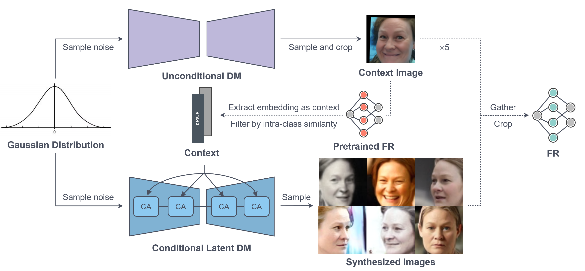

# CVPR24_FRCSyn_ADMIS
This is the official GitHub repository for our team's contribution (**ADMIS**) to 

# [2nd Edition FRCSyn: Face Recognition Challenge in the Era of Synthetic Data](https://frcsyn.github.io/CVPR2024.html)


* A summary paper will be published in the **[proceedings of the IEEE/CVF Computer Vision and Pattern Recognition Conference (CVPR) 2024](https://cvpr.thecvf.com/)**
## Pipeline
We use a latent diffusion model (LDM) based on [IDiff-Face](https://github.com/fdbtrs/IDiff-Face) to synthesize faces. The LDM is conditioned using identity embeddings as contexts, extracted from faces by a pretrained [ElasticFace](https://github.com/fdbtrs/ElasticFace) recognition model.


## Dataset and pretrained models
We use the CASIA-WebFace dataset to train an IDiff-Face diffusion model. The download link for our pretrained diffusion model weight is:
- [Pretrained LDM (25% CPD)](https://drive.google.com/file/d/1r8b-qlkZAkJeUQ8lPXzq7rTUjsMAuwZs/view?usp=sharing)

We use **10K** identities x 50 images dataset in SubTask 1.1/2.1 and **30k** identities x 50 images in SubTask 2.1/2.2. We provide the pre-generated synthetic **10K** identities dataset at:
- [ Syn_10k](https://drive.google.com/file/d/1aL7DpqGVFudp64x6p6eiNT-eQvqqJmYz/view?usp=drive_link)

We train the recognition model based on [TFace](https://github.com/Tencent/TFace). The pretrained IR-50 model trained on the Synthetic dataset can be accessible in: 
- [ IR-50 model + Syn_10k + ArcFace](https://drive.google.com/drive/folders/1A2blJzOswQJVB5Mlm4ZriKJ-XLgr4hQp?usp=drive_link)
- [ IR-50 model + Syn_30k + ArcFace](https://drive.google.com/drive/folders/1vv4807YRYO1zt8fvYXhGTNX2fn7Z8ey7?usp=drive_link)


The evaluation results of our pretrained face recognition models on widely used benchmark:

|    Backbone    |      Head      |       Dataset      |   Id   |  LFW  | CFP-FP | CPLFW | AGEDB | CALFW | Average |
| :------------: | :------------: | :----------------: | :----: | :---: | :----: | :---: | :---: | :---: | :----:  |
|      IR-50     |    ArcFace     |    CASIA_WebFace   | 10.5K  | 99.43 | 97.40  | 90.23 | 94.80 | 93.55 |  95.08  |
|      IR-50     |    ArcFace     |     IDiff-Face     |  10K   | 97.10 | 82.00  | 76.65 | 78.40 | 86.32 |  84.09  |
|      IR-50     |    ArcFace     |        DCFace      |  10K   | 98.60 | 88.21  | 83.33 | 88.18 | 91.38 |  89.94  |
|      IR-50     |    ArcFace     |    Syn_10k (ours)  |  10K   | 99.17 | 92.79  | 87.67 | 89.42 | 91.43 |  92.09  |
|      IR-50     |    ArcFace     |    Syn_30k (ours)  |  30K   | 99.52 | 94.66  | 89.75 | 91.78 | 93.13 |  93.77  | 


## Usage
Our method can mainly be divided into **identity conditioned LDM training**, **context enhanced sampling**, and **recognition model training**. Specifically, **identity conditioned LDM training** and **context enhanced sampling** are implemented based on the [IDiff-Face repository](https://github.com/fdbtrs/IDiff-Face). We make some modifications to its dataset and sampling codes. The implementation of **recognition model training** is fundamentally based on [TFace repository](https://github.com/Tencent/TFace), with only minor modifications applied to the 'transform' method to incorporate some additional cropping enhancements.

### 1. Identity conditioned LDM training
* **Install environment:** Please refer to ['How to use the code'](https://github.com/fdbtrs/IDiff-Face?tab=readme-ov-file#how-to-use-the-code) to set up the environment. 

* **Download the data and pretrained models required for training LDM:** The training **embeddings** used as contexts during training and their corresponding **images** have to be downloaded from the [link](https://drive.google.com/drive/folders/1OR93oblKiD4UvUTwZUHjvW80FeXHHnXz?usp=sharing) and placed under `dataset/CASIA`. 
The [pre-trained autoencoder](https://drive.google.com/drive/folders/1jEgr60OAR6hjbaF651723IBYG_DF0kGf?usp=drive_link) for the latent diffusion training is obtained from the pre-trained `fhq256` LDM from [Rombach et al.](https://github.com/CompVis/latent-diffusion/blob/main/models/ldm/ffhq256/config.yaml) please follow their license distribution. For training, make sure the tree of the directory is as follows:
  ```
    CVPR24_FRCSyn_ADMIS
    ├── dataset
    │   ├── CASIA
    │   │   ├── elasticface_embeddings # context file and image index file
    │   │   ├── CASIA_namelist.txt # for training
    │   │   └── images # decompressed CASIA-WebFace images
    │   ...
    ├── generative_model_training
    │   ├── ckpt
    │   │   ├── autoencoder
    │   │   │   ├── first_stage_decoder_state_dict.pt # for training
    │   │   │   └── first_stage_encoder_state_dict.pt # for training
    │   │   ...
    │   ...
    ...
    ```
* **Start training:**
It has to be ensured that the `dataset: CASIA_file` option is set and that the paths in the corresponding subconfiguration `generative_model_training/configs/dataset/CASIA_file.yaml` are pointing to the training images and pre-extracted embeddings. The model training can be initiated by executing:
 ```
 cd generative_model_training
 python main.py
 ```

### 2. Context enhanced sampling
To synthesize new faces with unseen identities, [IDiff-Face](https://github.com/fdbtrs/IDiff-Face) suggests a noise embedding sampled from Gaussian distribution could serve as the LDM’s context. However, we observe that such synthesized faces exhibit weak identity consistency. We employ another unconditional DDPM, pretrained on the FFHQ dataset, to help generate high-quality contexts. 
* **Prepare contexts:**
To facilitate ease of use, we have directly supplied the pre-generated context faces along with the context embeddings processed via the [Elasticface](https://github.com/fdbtrs/ElasticFace) model. Please download them from this [link](https://drive.google.com/drive/folders/1fss6Y6d25lzxaUXT2YgdxezgXUJkm4Zp?usp=sharing) and place them in `dataset/context_database`. For sampling, make sure the tree of the directory is as follows:
  ```
    CVPR24_FRCSyn_ADMIS
    ├── dataset
    │   ├── context_database
    │   │   ├── elasticface_embeddings # context file 
    │   │   └── images # decompressed context faces images
    │   ...
    ...
    ```
* **Run sampling script:**
If you choose to utilize our pretrained LDM checkpoint, please download the [Pre-trained LDM (25% CPD)](https://drive.google.com/file/d/1r8b-qlkZAkJeUQ8lPXzq7rTUjsMAuwZs/view?usp=sharing) and make sure the tree of the directory is as follows:
    ```
    CVPR24_FRCSyn_ADMIS
    ├── generative_model_training
    │   ├── ckpt
    │   │   ├── ADMIS_FRCSyn_ckpt
    │   │   │   └── ema_averaged_model_200000.ckpt # for sampling  
    │   │   ...
    │   ...
    ...
    ```
  Then the sampling process can be initiated by executing:
  ```
  cd generative_model_training
  python sample.py
  ```
* **ID augmentation:** We employ the oversampling strategy from [DCFace](https://github.com/mk-minchul/dcface), by mixing up the context face (augmented 5 times) with its corresponding synthesized faces. Please run:
  ```
  cd generative_model_training
  python id_augment.py
  ```

### 3. Recognition model training


* **Prepare TFR format data:**
  To convert raw image to tfrecords, generate a new data dir including some tfrecord files and a index_map file, please run:
  ``` bash
  cd recognition_model_training
  python3 tools/img2tfrecord.py --img_list YOUR_IMAGE_ROOT --tfrecords_dir SAVE_ROOT --tfrecords_name SAVE_NAME
  ```


*  **Train:**
  Modified the `DATA_ROOT` and `INDEX_ROOT` in `train.yaml`, `DATA_ROOT` is the name of the tfrecord file,  `INDEX_ROOT` is the name of the index file.
    ```bash
    cd recognition_model_training
    bash local_train.sh
    ```

* **Test:**
  Detail implementations and steps see [Test](https://github.com/Tencent/TFace/tree/master/recognition/test) in [TFace](https://github.com/Tencent/TFace) repository. 

If you have more questions, please contact **zzhizhou66@gmail.com**.


## Acknowledgement
This repo is modified and adapted on these great repositories, we thank these authors a lot for their great efforts.
* [IDiff-Face](https://github.com/fdbtrs/IDiff-Face)
* [TFace](https://github.com/Tencent/TFace)
* [DCFace](https://github.com/mk-minchul/dcface)
